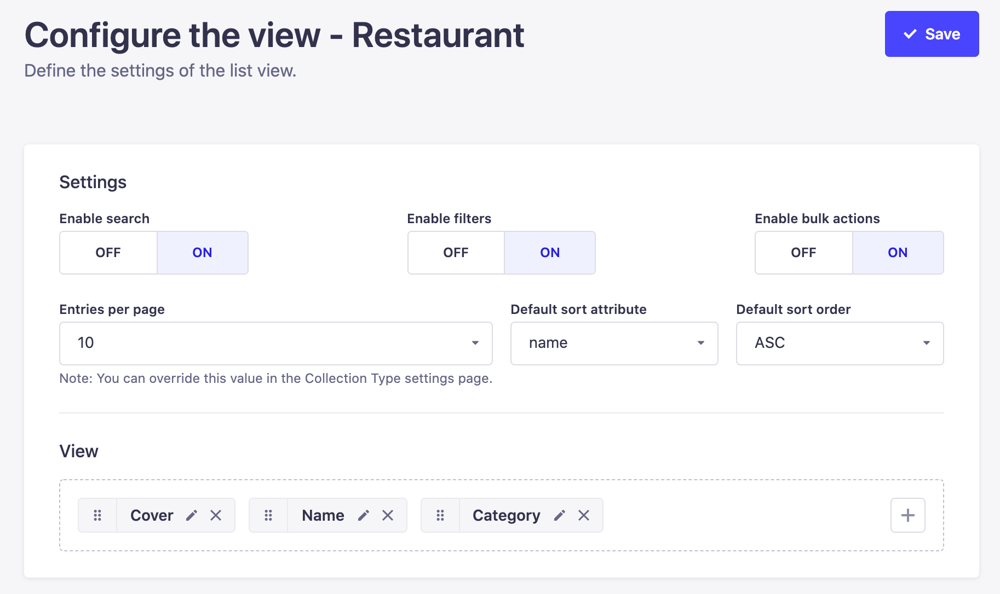
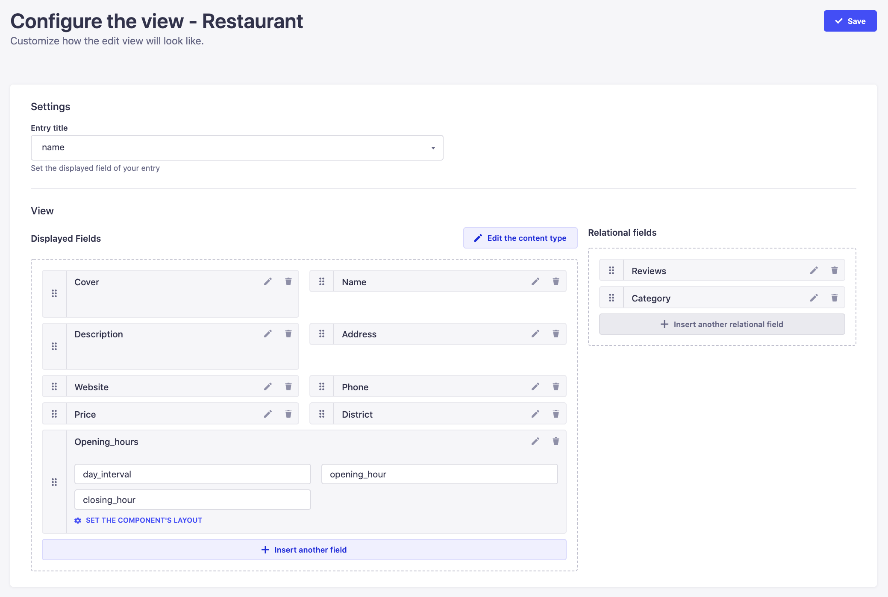

# Configuring the views of a content type

Depending on their type, content types can be divided into 2 interfaces: the list view and the edit view. Both interfaces can be configured.

## Configuring the list view

On the right side of the list view interface, right above the table, a settings button  is displayed. It allows to access the configurations that can be set for the list view of your collection type, and to choose which fields to display in the table.

::: note
The configurations only apply to the list view of the collection type from which the settings are accessed (i.e. disabling the filters or search options for a collection type will not automatically also disable these same options for all other collection types).
 
Note also that the explanations below explain how to permanently configure which fields are displayed in the table of the list view of your collection type. It is also possible to configure the displayed fields temporarily (see [Introduction to content manager](../content-manager/introduction-to-content-manager.md)).
:::

### List view settings

1. In the list view of your collection type, click on the settings button .
2. Click on the **Configure the view** button.
3. In the Settings area, define your chosen new settings:

| Setting name           | Instructions                                                                                       |
| ---------------------- | -------------------------------------------------------------------------------------------------- |
| Enable search          | Click on **ON** or **OFF** to able or disable the search.                                          |
| Enable filters         | Click on **ON** or **OFF** to able or disable filters.                                             |
| Enable bulk actions    | Click on **ON** or **OFF** to able or disable the multiple selection boxes in the list view table. |
| Entries per page       | Choose among the drop-down list the number of entries per page.                                    |
| Default sort attribute | Choose the sorting field and type that will be applied by default.                                 |

4. Click on the **Save** button.

### List view display

1. In the list view of your collection type, click on the settings button .
2. Click on the **Configure the view** button.
3. In the View area, define what fields to display in the list view table, and in what order:
   - Click the add button  to add a new field.
   - Click the delete button  to remove a field.
   - Click the reorder button  and drag and drop it to the place you want it to be displayed among the other fields.
4. Click the edit button  to access its available own settings:

| Setting name              | Instructions                                                              |
| ------------------------- | ------------------------------------------------------------------------- |
| Label                     | Write the label to should be used for the field in the list view table.   |
| Enable sort on this field | Click on **ON** or **OFF** to able or disable the sort on the field.      |

5. Click on the **Save** button.

::: note
Relational fields can also be displayed in the list view. There are however some specificities to keep in mind:

- Only one field can be displayed per relational field.
- Only first-level fields can be displayed (i.e. fields from the relation of a relation can't be displayed).
- If the displayed field contains more than one value, not all its values will be displayed, but a counter indicating the number of values. You can hover this counter to see a tooltip indicating the first 10 values of the relational field.

Note also that relational fields have a couple limitations when it comes to sorting options:

- Sorting cannot be enabled for relational fields which display several fields.
- Relational fields cannot be set as default sort.
:::

## Configuring the edit view

In the edit view of a content type, in the right side of the interface, a **Configure the view** button is displayed. It allows to access the configurations that can be set for the edit view of the content type, such as the entry title, and the display of the fields of the content type, including the relational ones.

### Edit view settings

1. In the edit view of your content type, click on the **Configure the view** button.
2. In the Settings area, define your chosen new settings:

| Setting name    | Instructions                                                                          |
| --------------- | ------------------------------------------------------------------------------------- |
| Entry title     | Choose among the drop-down list the field that should be used as title for the entry. |

3. Click on the **Save** button.

### Edit view display

1. In the edit view of your content type, click on the **Configure the view** button.
2. In the View area, define what fields to display in the list view table, and in what order:
   - Click the add button  to add a new field.
   - Click the delete button  to remove a field.
   - Click the reorder button  and drag and drop it to the place you want it to be displayed among the other fields.
3. Click the edit button  to access its available own settings:

| Setting name    | Instructions                                                                              |
| --------------- | ----------------------------------------------------------------------------------------- |
| Label           | Write the label to should be used for the field.                                          |
| Description     | Write a description for the field, to help other administrators fill it properly.         |
| Placeholder     | Write the placeholder that should be displayed by default in the field.                   |
| Editable field  | Click on **ON** or **OFF** to able or disable the edition of the field by administrators. |

4. Click on the **Save** button.

::: caution
The settings and display of a component's fields cannot be managed and reordered through the entry's edit view configuration page. Click on the **Set the component's layout** button of a component to access the component's own configuration page. You will find the exact same settings and display options as for the entry, but that will specifically apply to your component.

Note also that the settings are defined for the component itself, which means that the settings will automatically be applied for every other content type where the component is used.
:::

#### Relational fields

On the right side of the View area is displayed a Relational fields part. As in the edit view, regular fields and relational fields are managed separately (see [Managing relational fields](managing-relational-fields.md)). Although most configuration options are similar to regular fields', relational fields configurations have some specificities.

To define what relational fields of an entry should be available in the edit view, the following options are available:

- the **Insert another relational field** button, to add another relational field to your entry. If the button remains unclickable, it means that no other relational field can be added.
- the delete button , to remove a relational field.
- the reorder button , to drag and drop to the place you want your relational field to be displayed among the others.

As for regular fields, it is possible to access the available settings of the relational fields by clicking on their name. Most settings are the same as for regular fields (see [Edit view display](./configuring-view-of-content-type.md#edit-view-display)) except for "Entry title" which is only available for relational fields. It is recommended to choose well the entry title of relational fields as the more comprehensive it is, the easier it will be for administrators to manage the content of relational fields from the edit view.
